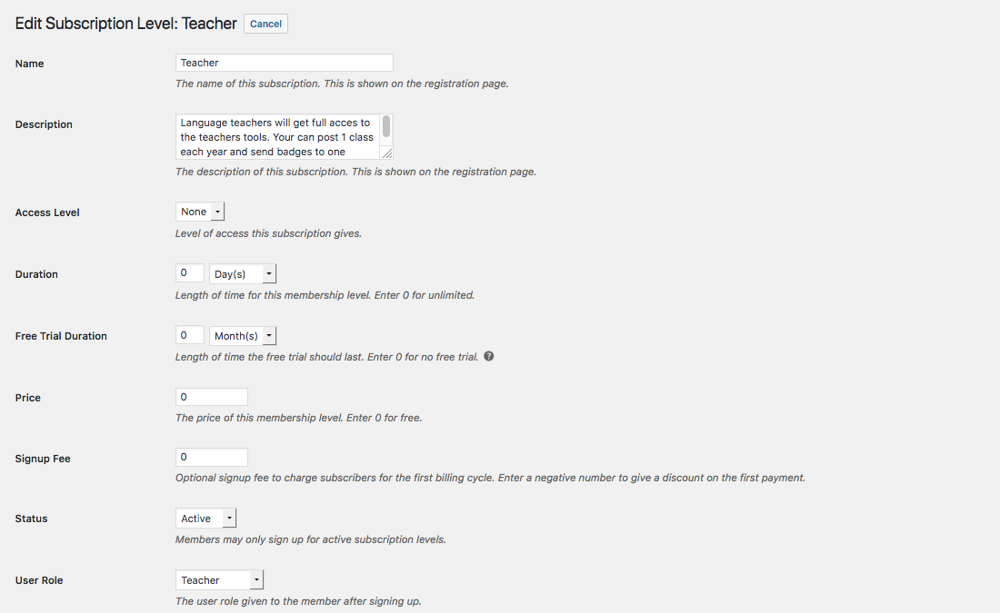
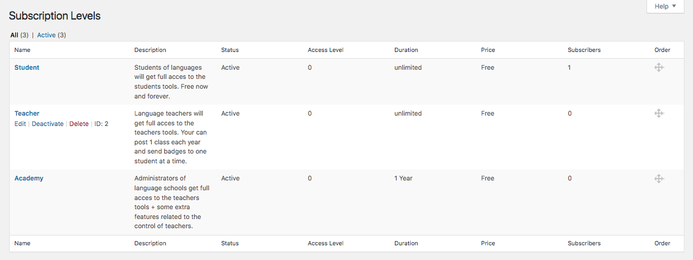

# OpenBadgesFramework Technical Documentation

## Installation and Upgrades
1. Clone (or copy) this [repository](https://github.com/Badges4Languages/OpenBadgesFramework/releases) to the /wp-content/plugins/ directory
1. Activate the plugin through the 'Plugins' screen in WordPress

For upgrades, download the las stable version from github, delete from FTP the old plugin and install the new one.

### Installing Required Plugins
If we were to try to create our plugin without the use of existing plugin solutions we simply would not exist. There is no sustainable way to develop all the functionality needed for our plugin while still being able to offer a competitive price.

* [WP Job Manager (free)](https://wordpress.org/plugins/wp-job-manager/)
* [Reviews for Job Manager (free)](https://astoundify.com/products/wp-job-manager-reviews/)

### Installing Recomended Plugins for the Site
Not all the plugins are 100% integrated with OpenBadgesFramework, some of them works in the site for an enhancement of the features of the site.
* [Restrict Content Pro or RCP (paid)](https://restrictcontentpro.com/) here the free download alternative from [GitHub](https://github.com/restrictcontentpro/restrict-content-pro)
  - [Restric Content](https://es.wordpress.org/plugins/restrict-content/) can it be a simple option.
* [The Seo Framework OR TSF (free)](https://theseoframework.com/) here the download alternative from [GitHub](https://github.com/sybrew/the-seo-framework)
* [WordFence or WF (free)](https://www.wordfence.com/) here the download alternative from [WordPress.org](https://es.wordpress.org/plugins/wordfence/ )
* [BackupWordpress](https://es.wordpress.org/plugins/backupwordpress/)
* [Easy wp smtp](https://es.wordpress.org/plugins/easy-wp-smtp/)
* [Members](https://es.wordpress.org/plugins/members/)
* [wp-sweep](https://es.wordpress.org/plugins/wp-sweep/)
* [wp-dbmanager](https://es.wordpress.org/plugins/wp-dbmanager/)
* Social Media Feather 1.7.12 (Newer version have bad performance)

### Integrated Theme
Any theme can work with OpenBadgesFramework, but just themes that are integrated with Job Manager can use al the features of the plugin as both plugins are integrated.

At Books for Languages we use [Listify](https://themeforest.net/item/listify-wordpress-directory-theme/9602611?ref=colomet] as the theme for the platform. Here is the link to the (documentation)[http://listify.astoundify.com/).

Listify also use several plugins for an enhancement of the features of the theme.


#### Plugins
http://listify.astoundify.com/article/481-currently-compatible-add-ons

* [WP All Import](http://listify.astoundify.com/category/832-wp-all-import)
Import your listings from a CSV or XML file.
* [WP Job Manager](http://listify.astoundify.com/category/220-wp-job-manager)
Customization, Support, and More
* [WooCommerce Simple Registration](http://listify.astoundify.com/category/548-woocommerce-simple-registration)
Site Registration Using WooCommerce
* [WooCommerce Social Login](http://listify.astoundify.com/category/528-woocommerce-social-login)
Make It Easy for Customers to Login
* [WooCommerce](http://listify.astoundify.com/category/225-woocommerce)
Create a Shop
* [Restrict Content Pro](http://listify.astoundify.com/category/324-restrict-content-pro)
Restrict Content Based on Payment
* [FacetWP](http://listify.astoundify.com/category/314-facetwp)
Control Your Listing Filters
* [Listing Payments](http://listify.astoundify.com/category/222-listing-payments)
Charge to Post a Listing
* [JetPack](http://listify.astoundify.com/category/226-jetpack)
Social Sharing, Custom CSS, and More
* [Reviews](http://listify.astoundify.com/category/477-reviews)
Add In-Depth Review Options
* [Products](http://listify.astoundify.com/category/565-products)
Link WooCommerce Products to Listings
* [Contact and Claim](http://listify.astoundify.com/category/224-wp-job-manager---contact-listing)
Contact Listing Authors and Claim Listings
* [Tags/Ammenities](http://listify.astoundify.com/category/346-tags)
Tag and Organize by Terms
* [Regions/Locations](http://listify.astoundify.com/category/223-wp-job-manager---regions)
Filter by Predefined Regions
* [Bookmarks/Favorites](http://listify.astoundify.com/category/345-bookmarksfavorites)
Show Your Love for Listings


## Setup the plugin
### Plugin settings
#### Change the badges issuer informations
OpenBadges need some key information for the delivery of the badge. Without that information, the plugin will not work:
* Site Name
* Image URL
* WebSite URL
* Backpack account (mail)


#### Change issuer badges page links
The users have some shortcuts to make easy the process. Here are the place where the links to those shoutcuts are created:
* Change the role. From issues badges page to change the role page.
* Add class. Redirection page to creating a new class page.
* Get Badge. Redirection page for users after opening the email.


### Manage Roles
OpenBadgesFramework offer 3 types of roles:
* Student
* Teacher
* Academy

Out of the box, a new user can be (after the login) one of those roles (upon the configuration of the site) and later the administrator can change the role to a more related one.


If an automatization of the distribution of the roles are need it, RCP (or an alternative) must be activated and settup.



Remember to Asign a match to each [subscription level](http://docs.restrictcontentpro.com/article/1558-creating-subscription-levels) with the user role.



A select the role page is need it (can be free or paid upon the configuration).

The OpenBadgesFramework Settings page allow in **Links** to select the page where the [Register Form](http://docs.restrictcontentpro.com/article/1597-registerform) is created.

#### Student role
* Can receive badges and to keep the profile information.
* Can self issue a non certified badge.
* Can comment the class after receiving the badge.

#### Teacher role
The same as Student role plus:
* Can self issue a teacher badge.
* Can send a non certified badge to one student at a time.
* Save all the students information in one single class.
* Can answer the class Studens' comments.
* The profile can be delete but the Classes information can not ever be deleted.

#### Academy teacher role
* Can send a non certified badge to multiple students at a time.
* Can send a certified badge to one student/multiple students at a time.
* Can create multiple classes.

#### Administrator role
* Can send certified teachers badges

## Creation of the Badges
OpenBadgesFramework allow the creation of two types of badges for the **Administrators** of the site. Normal badges and Certified badges.
* Normal badges can be delivery by any user of the site with Teacher Role.
* Certified badges are allowed just for teachers with the Academy Role.

For the creation of a badge is necessary:
* Name: The name of the badge.
* Description: A description for the badge.
* Badge Criteria: The Criteria for different languages (just the first one is used).
* Image: The feature image.

Other information is necessary for the correct integration with the site:
* Content: information about the badge.
* The Certification Type: Not certified/Certified.
* The Target type: Student/Teacher.
* Field of education: the subject of the class (The second language). Not used.
* Levels: the level of the class (Students: A1-A2-B1-B2-C1-C2; Teachers: T1-T2-T3-T4-T5-T6).

Optional:
* Description translations (WP Comments): A translation of the description.

## Sending of badges (Issuer page)
OpenBadgesFramework allow to issue badges in 3 ways:

Administrators have the same functionalities as Academy teacher role plus the issue of certified Teacher badges.

Those are the options before to send a badge:
* language: the language the student learn.
* Level: the level of the class.
* Badge: the badge.
* Language of Badge description: by defaul the badges are created in english, but translations are available.
* Class: the student class name (with information such starting date and place).
* Receivers' mail address: the email of the student/s.
* Comment: a comment for the profile of the student/s.

If the student have a badge and a teacher send the same badge again, no updates in the information of the database.

By sending a badge, 3 Json file are created inside of the folder open-badges-framework>Json.

A file with the information about the website (just one file each installation):
issuer-info.json
```
{
  "name": "Badges4Languages",
  "url": "http://badges4languages.com",
  "description": "Issue and Earn Badges.",
  "image": "http://badges4languages.com/wp-content/uploads/2017/08/badges_for_Languages-badge.png",
  "email": "webmaster@Badges4Languages.com"
}
```
One Json file is the technical information about the badges

Example fo file name: badge-cc8197a1a66bd28d240934e16a895183f7a59e2285eb5e8b408ebba515ff
```
{
  "name": "A1 Valencian",
  "description": "FIELD: Valencian  \u2013  LEVEL: A1  \u2013  DESCRIPTION: Can understand and use familiar everyday expressions and very basic phrases aimed at the satisfaction of needs of a concrete type.\r\nCan introduce themselves and others and can ask and answer questions about personal details such as where he/she lives, people they know and things they have.\r\nCan interact in a simple way provided the other person talks slowly and clearly and is prepared to help.  \u2013  Additional information: Example of badge.",
  "image": "http://badges4languages.com/wp-content/uploads/2017/05/Badges4Languages-A1.0.png",
  "criteria": "http://badges4languages.com/open-badge/a1/",
  "tags": ["Valencian", "A1"],
  "issuer": "http://badges4languages.com/wp-content/uploads/open-badges-framework/json/issuer-info.json"
}

```
One Json file is the des

Example of the file name: cc8197a1a66bd28d240934e16a895183f7a59e2285eb5e8b408ebba515ffa5dd.json
```
{
  "uid": "5a3272e5b6ffb",
  "recipient": {
    "type": "email",
    "identity": "student@student.com",
    "hashed": false
  },
  "badge": "http://badges4languages.com/wp-content/uploads/open-badges-framework/json/badge-cc8197a1a66bd28d240934e16a895183f7a59e2285eb5e8b408ebba515ffa5dd.json",
  "verify": {
    "url": "http://badges4languages.com/wp-content/uploads/open-badges-framework/json/cc8197a1a66bd28d240934e16a895183f7a59e2285eb5e8b408ebba515ffa5dd.json",
    "type": "hosted"
  },
  "issuedOn": "2017-12-14",
  "evidence": ""
}

```

### Issuer page Self mode
A student/Teacher/Academy teacher role can receive a badge as Student or Teacher (Non certified).

* Language
* Level
* Badge
* Language of Badge description
* Comment

### Issuer page Issue mode
A Teacher/Academy teacher role can send a Student Badge (Non-Certified). An Academy teacher role can send a Student Badge (Certified)

* Language
* Level
* Badge
* Language of Badge description
* Class
* Receiver's mail address
* Comment

### Issuer page Multiple issue mode
An Academy teacher role can send Multiple badges to Multiple students (Certified and Non-Certified).

* language
* Level
* Badge
* Language of Badge description
* Class
* Receivers' mail address
* Comment

## Creation of Classes

## User profile
All the roles have a profile for tracking the information of the receive badges.

The save information in the profile is:
* Badge name
* Badge language
* Sender
* Comment

## Shortcodes
The frond-end fuctionality can be use in any page with the shortcode [send_badges]


Manage Listings and Content Organization

7 articles
Theme Settings

Modify Settings in Appearance ▸ Customize

30 articles
Menus

Customize and Output Menus

12 articles
Pages

Page Templates and Archives

12 articles
Widget Areas

The What and Where of Widgets

6 articles
Widgets

Homepage and Listing Widgets

24 articles
## Customization
Appearance

Modify Colors and More

26 articles
Booking Service Integration

Book Tables, Services, and More

2 articles
Customization Code Snippets

Collection of Code

46 articles
Child Themes

Advanced Customization Techniques

4 articles
Translations

Change Text and Words

### Integrations
#### Porfolio Integration
OpenBadgesFramework-Languages-Portfolio allow to create a portfolio for teacher and students of second languages.

Once activated, the portfolio will use the OpenBadges API for delivery of specific type of badges. Also the portfolio is used for the comprobation of the level of the teachers.

Back to [Readme](../README.md).
